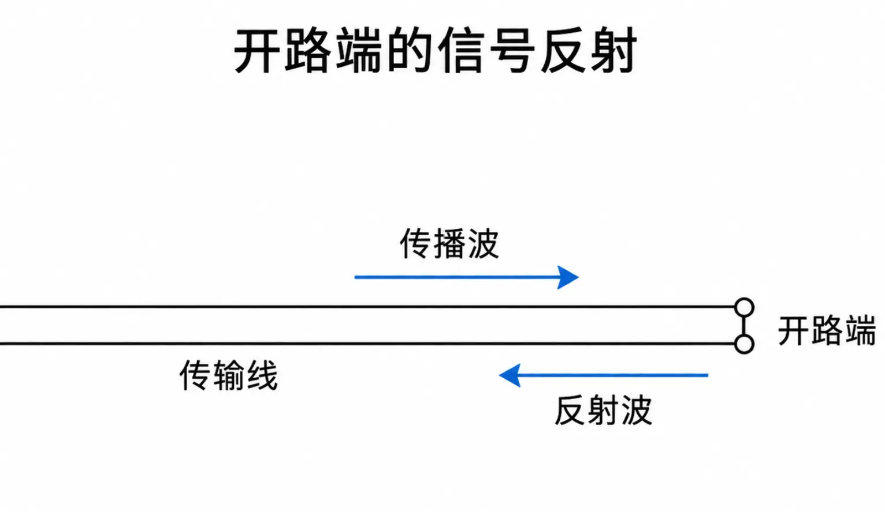
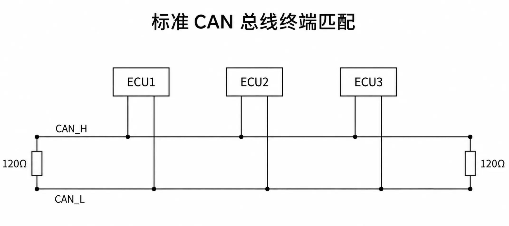
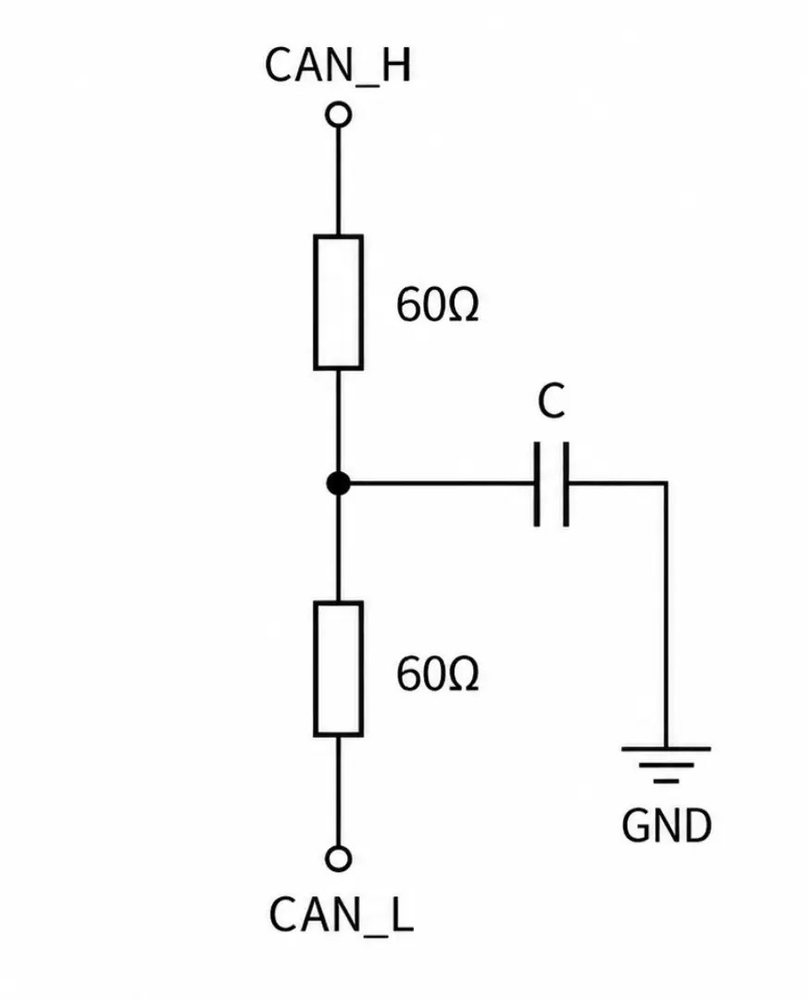

本文只讨论 CAN 为什么需要120Ω终端电阻及其基本原理，不展开终端电阻故障、波形检测、Bus-Off等实际排查问题。

最核心原理就四个字——**阻抗匹配**。

## 阻抗匹配是什么？

这里用镜面反射来简单理解一下什么是阻抗匹配，以及为什么要阻抗匹配。
电信号沿导线传播时，本质上伴随着电磁场的传播，而光本身也是一种电磁波，因此这里可以借助光的反射来建立一个直观的类比：
想象一束光照向镜子。光传播到两种性质不同的介质交界处时会发生反射，而镜子就是我们最熟悉的强反射现象之一。传输线中的电信号也有类似现象：当它传播到一个阻抗发生明显变化的边界时，也会产生反射。
所以我们需要在传输线末端放置一个与传输线特性阻抗接近的负载，“接住”这个信号，这样波的能量就会被负载吸收。 这就是所谓的**阻抗匹配**。
CAN总线通常采用一对双绞线，以总线的形式从一端到另一端，如果没有终端电阻，那么在端点处就是开路，会产生很强的反射，对信号产生干扰。

## 如何实现阻抗匹配？

工程上通常会在 CAN 总线的两个物理端点，各放置一个 120Ω 终端电阻，并将电阻跨接在 CAN_H 与 CAN_L 之间。如图：
  

### 为什么是120Ω？

因为CAN所用的双绞线的特性阻抗就≈120Ω。

### 为什么是两端各一个？

信号可从总线上任意节点的ECU中出发，波也同时向左右两边传播，因为两端都是传输线终点，两端都必须匹配，所以两端各120Ω。

### 为什么是跨接？

但是问题又来了：为什么是跨接的方式，而不是接地呢？
因为CAN是一个差分信号，CAN收发器关注的是：CAN_H相对于CAN_L的压差；
所以CAN通信传输的其实就是两根线之间的差分电压，而不是像UART那样，以GND作为主要信号参考；
因此，CAN需要匹配的是CAN_H与CAN_L这对线的差分阻抗（可以简单理解成：从 CAN_H 和 CAN_L 这对线组成的差分信号来看，这条传输线呈现出的阻抗）。
此外CAN通常还有一个共模电压，常见是2.5V，如果电阻直接接地，还改变了CAN 总线本来设置好的静态工作点。

## 如果没有这个电阻会怎样？

在短距离、低速或特定实验条件下，CAN仍然可以工作。
但是对于反射的信号，它依然会存在，只是反射存在 ≠ 一定通信失败。
问题在于什么条件下反射的信号会干扰通信？
当线路很短，传播延迟相对于信号边沿时间很小时，反射波与原始边沿在时间上难以明显分离，因此反射造成的影响往往比较小。
例如：总线长度只有20cm，那么信号在这条线中的往返一次时间大约为2ns（典型双绞线大约可以粗略看成 **1m 往返约10ns**），假设 CAN 收发器实际的上升沿时间是几十 ns 甚至更长，那么即使没有终端电阻，也可能正常通信。
反之线路越长、信号边沿越快，反射带来的影响通常越明显。因此正式 CAN 总线仍应按照物理层要求正确终端。

## 补充：为什么有些 CAN 电路用两个 60Ω？

终端电阻的另一个常见接法是：在一个需要终端匹配的总线端点，把原来的一个120Ω电阻拆成两个约60Ω电阻串联，并把两个电阻的中点通过电容接地，如图：
  
两个60Ω仍然提供约120Ω的差分终端，中点电容主要用于抑制高频共模噪声、改善 EMC 表现。

## 总结

CAN 总线之所以在两端各使用一个 120Ω 终端电阻，本质上是为了进行阻抗匹配，减小信号到达传输线末端时产生的反射；之所以选择 120Ω，是因为 CAN 常用双绞线的差分特性阻抗约为 120Ω；而电阻跨接在 CAN_H 与 CAN_L 之间，则是因为 CAN 本身就是通过两根线之间的差分电压来传递信号。看起来只是“两个120Ω电阻”的简单规定，背后其实是一整套从传输线、信号反射到差分通信的设计逻辑。

## 参考资料

1. Texas Instruments, *Top Design Questions About Isolated CAN Bus Design*, SLLA486C
  [TI 官方 PDF](https://www.ti.com/lit/pdf/slla486?utm_source=chatgpt.com)
2. Microchip, *A CAN Physical Layer Discussion*, Application Note AN228
  [Microchip 官方 PDF](https://www.microchip.com/content/dam/mchp/documents/OTH/ApplicationNotes/ApplicationNotes/00228a.pdf?utm_source=chatgpt.com)
